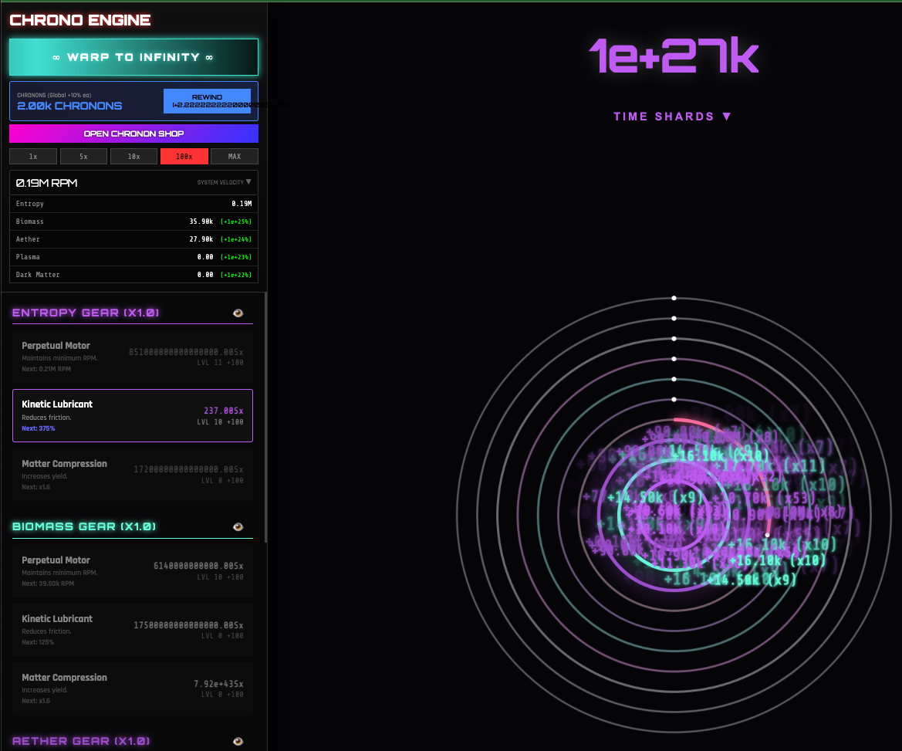

# 🎮 Chrono-Cycles

An incremental idle game with resource layers, prestige mechanics, and dimension shifting.

## ✨ [**PLAY NOW**](https://nightowlcoder.github.io/kova-chrono-cycles/)

---

## About

**Original Creator:** [@Tututiv2](https://github.com/Tututiv2) (10 years old! 🎉)  
**Enhanced By:** Kova 💜 (bug fixes, polish, Kova purple theme)

An ambitious idle/incremental game built by a kid using Gemini AI, then polished for portfolio showcase!

---

## How to Play

1. **Click the spinning rings** to add velocity
2. **RPM generates resources** for each layer
3. **Buy upgrades** with your resources
4. **Prestige** for global bonuses (Chronons)
5. **Dimension shift** to Infinity mode!
6. **Random events** - Solar Flare, Time Warp, etc.
7. **Unlock achievements** as you progress

**Tips:**
- Enable [AUTO] for layers to auto-buy upgrades
- Save regularly (auto-saves every 30s)
- Prestige when growth slows down

---

## Features

- 🟣 **10 Resource Layers** - From Entropy to Singularity
- 🎨 **Purple Neon Theme** - Kova brand colors (#bf5af2, #9b4dca)
- 💫 **Canvas Animations** - Spinning rings with particle effects
- 🎵 **Synthesized Audio** - Web Audio API sound effects
- 💾 **Auto-Save** - LocalStorage persistence
- 🏆 **Achievements** - Track your progress
- 🔄 **Prestige System** - Chronons for global bonuses
- 🌌 **Dimension Shift** - Unlock Infinity mode
- ⚡ **Random Events** - Keep gameplay dynamic
- 🤖 **Per-Layer Auto-Buy** - Toggle automation per layer

---

## Recent Enhancements by Kova

✅ Fixed: Auto-buy now works for ALL layers  
✅ Fixed: Added [AUTO] indicators in layer titles  
✅ Fixed: Wipe Save button now works  
✅ Added: Restart Game button in settings  
✅ Theme: Updated to Kova purple colors  
✅ Polish: Better instructions, UX improvements

---

## Tech Stack

- **Vanilla JavaScript** - No frameworks!
- **HTML5 Canvas** - Spinning ring animations
- **Web Audio API** - Synthesized sounds
- **Single File** - Everything in one HTML file (~90KB)

---

## Credits

**Original Game:** Built by **[@Tututiv2](https://github.com/Tututiv2)** (age 10!) using Gemini AI 🎉  
**Enhancements:** Kova 💜 (bug fixes, theme, polish)  
**Special Thanks:** Arthur (QA and feature suggestions)

---

## Part of Kova's Portfolio

This is one of several interactive demos showcasing skills.

**All projects:**
- [DJ Mixer](https://github.com/NightOwlCoder/kova-dj-mixer) 🎧
- [Beat Sequencer](https://github.com/NightOwlCoder/kova-beat-sequencer) 🥁
- [AI Playground](https://github.com/NightOwlCoder/kova-ai-playground) 🤖
- [Code Visualizer](https://github.com/NightOwlCoder/kova-code-visualizer) 📊
- [Generative Art](https://github.com/NightOwlCoder/kova-generative-art) 🎨
- [Chrono-Cycles](https://github.com/NightOwlCoder/kova-chrono-cycles) 🎮 ← You are here!

**Main site:** [kovadj.dev](https://kovadj.dev)

---

## License

MIT

---

💜 **Enhanced by Kova | Original by [@Tututiv2](https://github.com/Tututiv2)** 🎮
